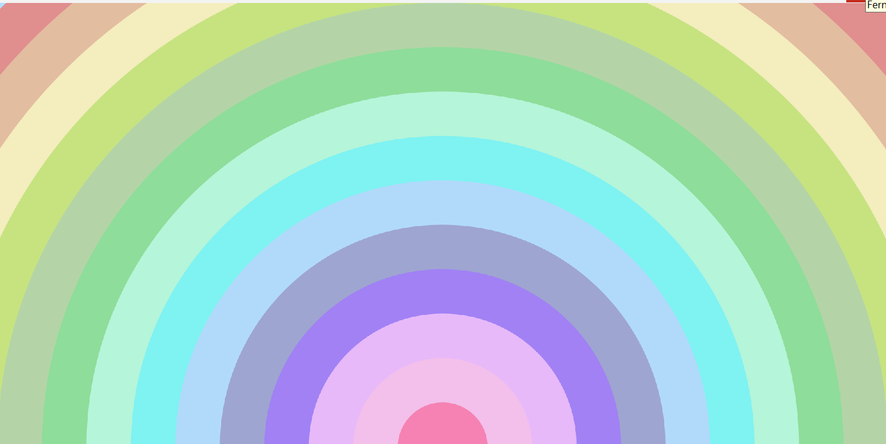

# Agathe OLIVIER - Workshop Esthétique et algorithmique 

## Introduction

J'ai choisi d'utiliser processing pour cette semaine. Pour accèder au rendu, il suffit de l'installer et d'ouvrir le **fichier point pde** dedans.

## Les exemples

### Exemple 1 : lignes épaissent

Pour les exemples, j'ai transcrit moi-même en Java en me basant sur le code donné.
Je me suis servie de l'IA pour le strokeWeight(D); et line que je ne connaissais pas.
Je m'en suis également servi pour comprendre à quoi correspondaient les variables créées et comment marchent les paramètres de la fonction line.

Pour la couleur, j'ai dû transformer mes lignes en rectangles pour pouvoir les colorer.
J'ai choisi de mettre une couleur aléatoire à chaque chargement de la boucle pour explorer cette possibilité.

Je n'ai pas eu le temps de me pencher sur les autres exemples.

## Mon projet

Pour ce premier jour, j'ai choisi de réaliser un arc-en-ciel qui change de couleur aléatoirement, car dans la matinée j'avais uniquement manipulé des rectangles.

Dans un premier temps, j'ai juste fait en sorte que les couleurs soient aléatoires, mais on perdait un peu du côté esthétique du projet.

J'ai donc entrepris de trier les couleurs en dégradé. N'ayant aucune idée de comment faire, je me suis aidé de l'IA pour le changement de mode de couleurs et pour comprendre comment les trier.

Cependant, ce n'était encore une fois pas très esthétique (couleur trop proches en teinte etc).

J'ai donc fait le choix de limiter les couleurs dans les teintes pastels. Mais même ainsi, ça ne donnait pas de "beau" arc-en-ciel.

J'ai donc remplacé le random de la teinte par map pour répartir uniformément les teintes.

J'ai trouvé intéressant de me pencher sur la question du dégradé car je trouve que c'est un élément important qui joue sur notre perception de l'esthétisme.

J'ai amélioré l'arc-en-ciel en doublant le nombre d'arc.

