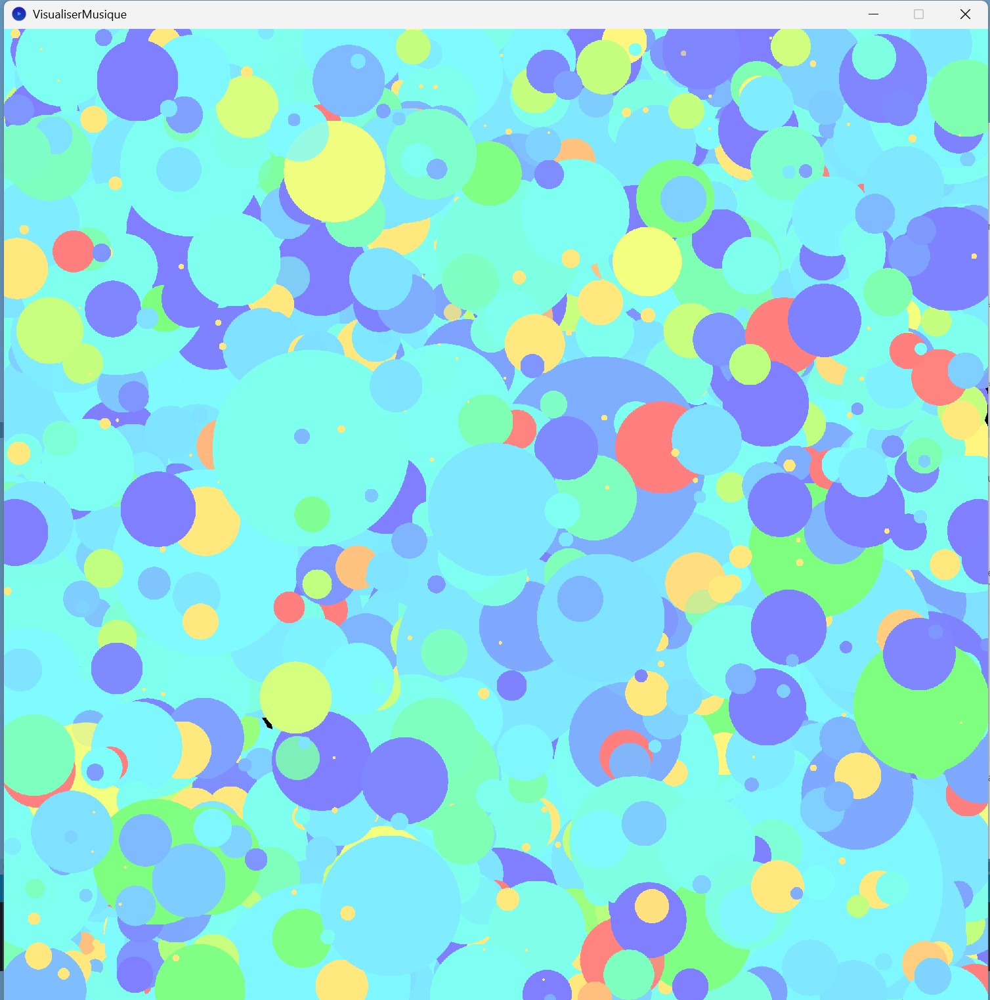
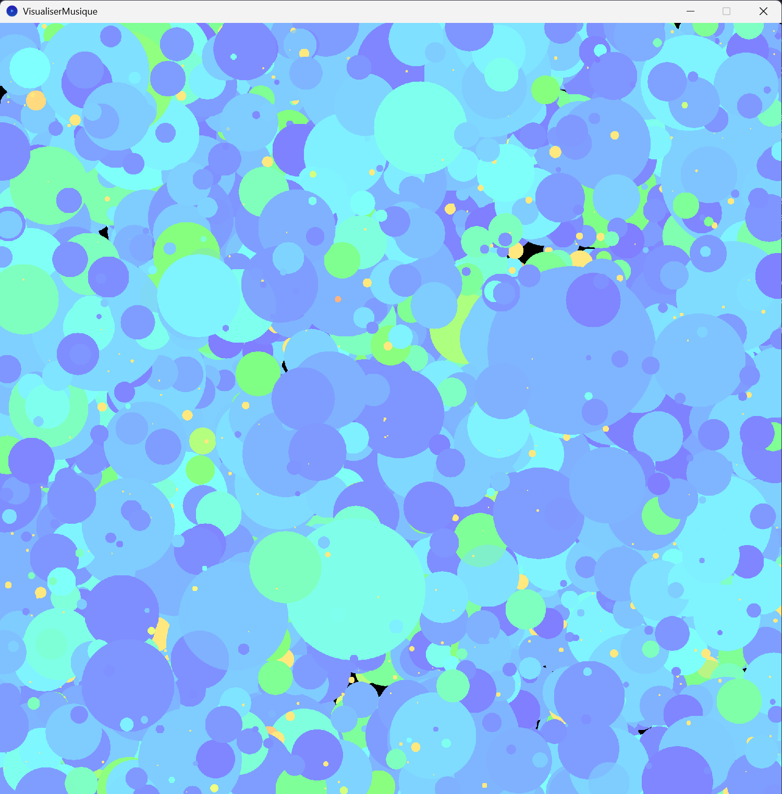

# Agathe OLIVIER - Workshop Esthétique et algorithmique 

## Introduction

J'ai choisi d'utiliser processing pour cette semaine. Pour accèder au rendu, il suffit de l'installer et d'ouvrir le **fichier point pde** dedans.

Ce projet nécessite la **bibliothèque minim** disponible via processing dans Sketch => Import Library => Add Library

## L'intention

**Objectif : Rendre la musique "visible"**

Le principe est simple : on détecte approximativement quelle note est jouée. Si elle est grave / basse, elle est dans les teintes froides. Si elle est aiguë, elle s'approchera des couleurs chaudes.
Plus on entend fort la note, plus le point généré pour la représenter est gros.

Par frame, deux cercles sont générés : un pour les basses et un pour ma mélodie. Les cercles disparaissent en dégradé, la vitesse de disparition n'est pas liée à la durée de la note.

## Les modes

**Appuyez sur espace pour passer en mode tableau** : Permet à la fin de la musique d'avoir un tableau qui la représente.

**Appuyez une nouvelle fois sur espace pour repasser en mode écoute** : Permet d'avoir une représentation dynamique de la musique, d'avoir son état à un instant t.

**Appuyez sur une flèche droite ou gauche pour changer de musique** : Il y a deux musiques, une plus grave et une avec des aigus pour tester les rendus.

Musique avec des aigus (Carol of the Bells) :

Musique avec des grave (Her) :

## Réalisation

L'idée est de se servir de la bibliothèque minim pour récupérer les fréquences des musiques. Ensuite, on cherche lorsqu'une fréquence a un pic : c'est que la note est jouée. On stocke cette valeur et on lui génère le cercle associé positionné aléatoirement dans la toile. On fait pareil pour le deuxième point des basses.

Pour ce projet, je me suis servi de tout ce que j'ai appris en travaillant sur les autres projets cette semaine (créer des formes dynamiques, des dégradés, de l'interactivité...).

Je me suis aidée de l'IA pour le débug et comprendre le fonctionnement de minim. N'étant pas très bonne en traitement du signal pour l'instant, j'ai demandé à l'IA des explications sur comment récupérer la note jouée. 

Sur le moment, j'ai eu du mal à comprendre le principe de comparaison d'amplitude et je n'étais pas sûr d'y arriver, mais j'ai énormément appris en réalisant ce projet.

## Pistes d'amélioration

Il faudrait améliorer le rendu et le dégradé de couleur : il y a beaucoup de bleu pour l'instrumental. Peut-être trouvé une autre représentation que des points ?

J'aurais aimé que les points liés à la mélodie durent le temps que la note est jouée, mais c'était trop complexe (il aurait fallu deux fichiers mp3 et séparer l'instrumental de la mélodie etc), mais ça pourrait être une piste d'amélioration.